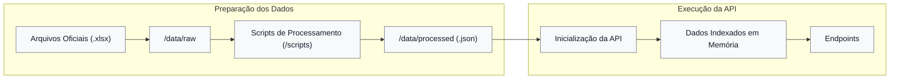

# Mapper RTC
> Serviço de consulta e mapeamento cruzado entre a LC 116/2003 e os novos indexadores de IBS/CBS.


`mapper-rtc` é uma API desenvolvida em Python com FastAPI para simplificar a consulta de correlações fiscais trazidas pela Reforma Tributária do Consumo. 

Focada na estrutura do `Anexo VIII`, ela mapeia a relação entre os itens da _[Lei Complementar nº 116, de 31 de julho de 2003](https://www.planalto.gov.br/ccivil_03/leis/lcp/lcp116.htm)_ e os novos indexadores do **IBS** e **CBS**, cruzando códigos **NBS**, indicadores de operação (`cIndOp`) e classificações tributárias (`cClassTrib`).

A API adota uma **arquitetura de dados em memória**. Eles são lidos e indexados em dicionários apenas uma vez, no momento em que a aplicação inicializa.

### 📁 Estrutura do projeto

```text
mapper-rtc/
│
├── app/                         # Código-fonte da API
│   ├── models/                  # Modelos e schemas de dados
│   ├── routes/                  # Definição dos endpoints
│   ├── services/                # Regras de negócio e serviços
│   └── main.py                  # Ponto de entrada da aplicação
│
├── data/
│   ├── raw/                     # Planilhas oficiais (.xlsx)
│   └── processed/               # Arquivos JSON processados
│
├── scripts/                     # Pipeline de processamento dos dados
│   ├── extractor.py             # Extração dos dados das planilhas
│   ├── transform.py             # Transformação e normalização dos dados
│   ├── exporter.py              # Exportação para JSON
│   └── runner.py                # Executa todo o pipeline ETL
│
├── .gitignore
├── README.md
└── requirements.txt
```

### ⚙️ Como os dados são processados 

Os dados têm origem nas tabelas oficiais de correlação publicadas pelo _[Ambiente Nacional da NFS-e](https://www.gov.br/nfse/pt-br/biblioteca/documentacao-tecnica/rtc)_, distribuídas originalmente em `.xlsx`

> [!IMPORTANT]
> O projeto foi arquitetado para receber **atualizações manuais e incrementais**, acompanhando a publicação de novas versões das tabelas oficiais disponibilizadas pelo **Ambiente Nacional da NFS-e**.

O processamento dos dados ocorre em duas etapas distintas: **preparação** e **execução**.

Durante a etapa de preparação, as informações são armazenadas na pasta `/data/raw`. Em seguida, os scripts localizados em `/scripts` realizam a extração, normalização e transformação dessas planilhas, gerando arquivos **JSON** estruturados na pasta `/data/processed`.

Na etapa de execução, a API carrega todos os arquivos JSON presentes em `/data/processed` durante sua inicialização. Esses dados são indexados em memória e permanecem disponíveis durante todo o ciclo de vida da aplicação, eliminando leituras repetidas em disco e proporcionando consultas rápidas e de baixa latência.

O fluxo completo pode ser representado da seguinte forma:


**Processar os dados (Opcional)**

Se precisar atualizar ou reprocessar as planilhas da pasta `/data/raw`:
```bash
python scripts/runner.py
```

### 📑 Documentação da API 

A API utiliza o padrão **OpenAPI** e disponibiliza uma interface interativa por meio do **Swagger UI**, permitindo visualizar todos os endpoints, contratos de dados e realizar testes diretamente pelo navegador. _[Acesse aqui a Documentação Oficial](http://mapper-rtc.com.br/docs)_.

### 🗺️ Endpoints Disponíveis 

| Método | Endpoint | Descrição |
| :--- | :--- | :--- |
| `GET` | `/status` | Verifica a disponibilidade da API e fornece informações de execução. |
| `GET` | `/{version}/lc116/{code}` | Consulta as correlações de um item da LC 116/2003 para uma versão específica do Anexo VIII. |

O parâmetro `{version}` identifica a versão da tabela de correlação utilizada na consulta. Atualmente, a API disponibiliza as seguintes versões:

| Versão | Descrição |
| :--- | :--- |
| `v1-00-00` | Primeira versão publicada do Anexo VIII. |
| `v1-01-00` | Primeira atualização oficial do Anexo VIII. |

### 🚀 Executando localmente

**Pré-requisitos**

``` text
Python 3.12+
Git
```
**Clone o repositório**

```bash
git clone https://github.com/arhspe/mapper-rtc.git
```

```bash
cd mapper-rtc
```
**Crie um ambiente virtual**

_Linux/macOS_

```bash
python -m venv .venv
```
```bash
source .venv/bin/activate
```

_Windows_

```powershell
python -m venv .venv
```
```powershell
.venv\Scripts\activate
```

**Instale as dependências**

```bash
pip install -r requirements.txt
```

**Execute a aplicação**

```bash
uvicorn app.main:app --reload
```

Após a inicialização, a API estará disponível em:

```
http://localhost:8000
```
> _A rota raiz redireciona automaticamente para a documentação interativa do Swagger._

### 📋 Aviso Legal

> [!WARNING]
> `mapper-rtc` é um projeto **independente**, desenvolvido para facilitar o acesso e a consulta às correlações fiscais publicadas oficialmente pelo **Ambiente Nacional da NFS-e**. Este projeto **não possui qualquer vínculo, afiliação, autorização ou endosso** de qualquer órgão ou entidade pública.
>
> Embora os dados tenham como base documentos oficiais, **não há garantia de que as informações estejam completas, atualizadas ou livres de inconsistências**. É responsabilidade do usuário validar os resultados com as publicações oficiais vigentes antes de utilizá-los em processos fiscais, contábeis ou jurídicos.
>
> O autor deste projeto **não se responsabiliza por quaisquer perdas, danos ou prejuízos decorrentes da utilização desta API**.